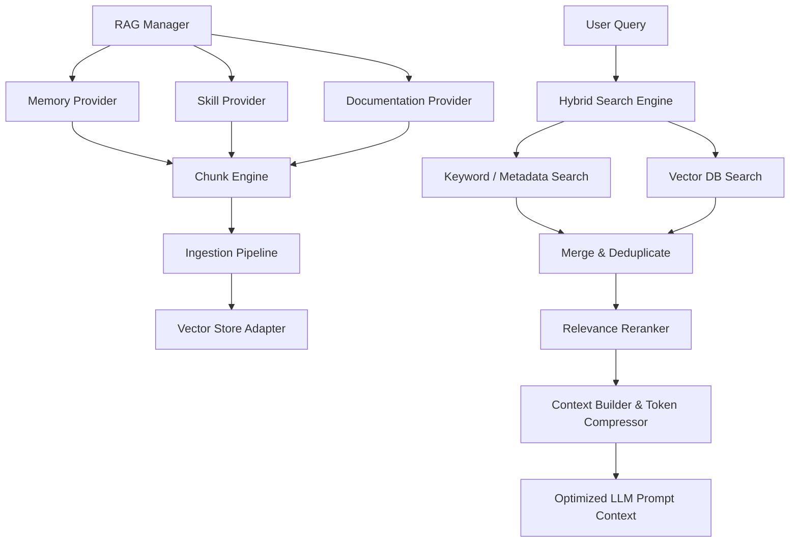
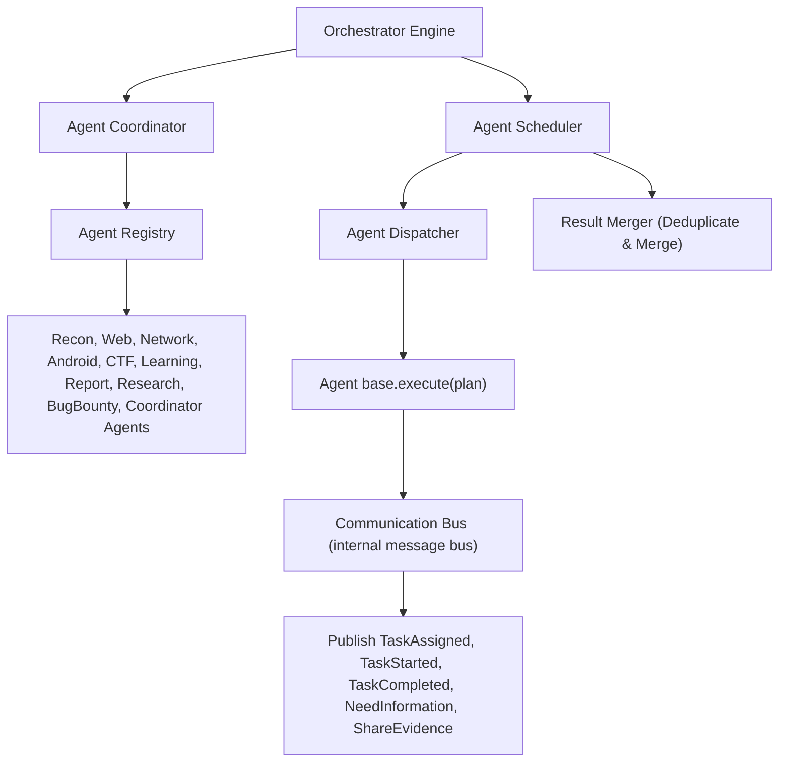
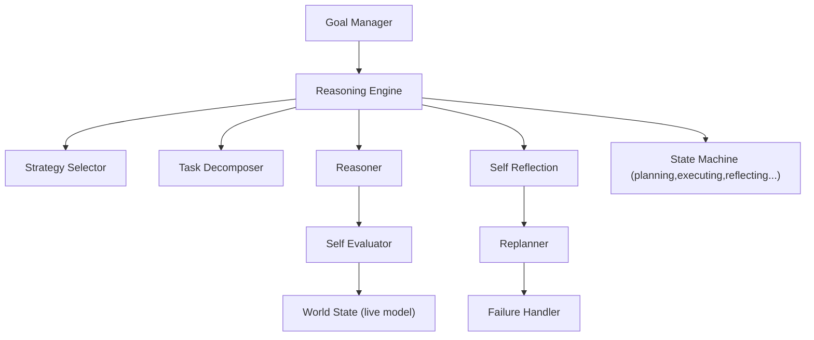
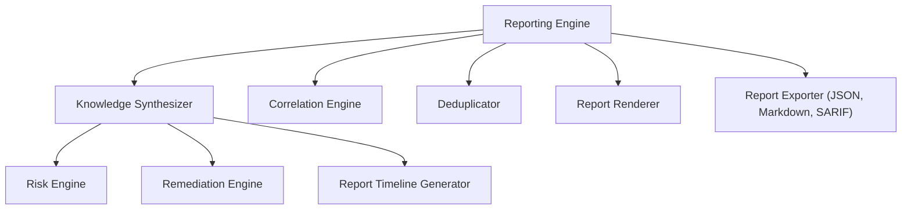
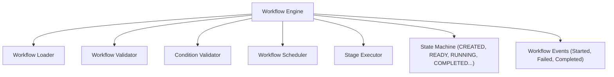
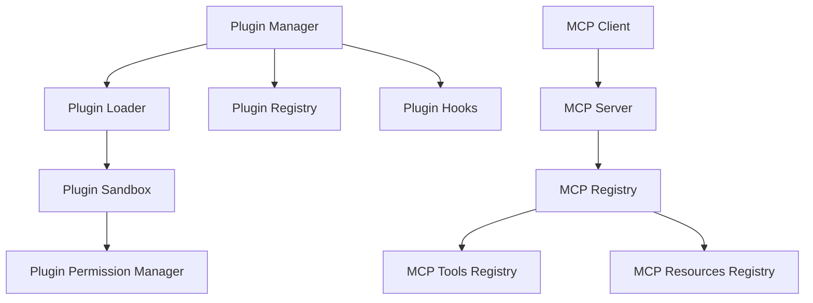

# RedForge Architecture

This document describes the architectural layout of RedForge.

## Architectural Layers

### 17. React Operator Dashboard (`dashboard/`) — Phase 17
A modern, single-page operations interface built with React, Vite, and Tailwind CSS. It communicates exclusively with the Unified API Gateway over HTTP/REST and WebSockets.
* **`layouts/DashboardLayout.tsx`**: Embeds sidebar navigation panels, active session switcher, API connection status monitors, and light/dark theme toggles.
* **`pages/`**: Includes Overview metrics, AI streaming chat terminal, modular workflow triggers, report preview, live terminal tool runner, memory notes repository, and plugin toggling controls.
* **`services/api.ts`**: Client SDK wrapping fetch requests and WebSocket initializations. Tested under `services/api.test.ts`.
* **`contexts/`**: Shared settings context (CORS API URLs, JWT keys, user themes) and sessions context (active session states).

### 16. Unified API Gateway (`src/redforge/api/`) — Phase 16
The **only public entry point** into RedForge. Every external client (CLI, React Dashboard, VS Code Extension, MCP Clients, Mobile App) communicates exclusively through this gateway. Zero business logic lives here — it delegates to internal engines.

**Sub-components:**
* **`app.py`**: FastAPI application factory (`create_app()`). Registers all middleware, exception handlers, REST routers, and WebSocket routes.
* **`server.py`**: uvicorn entry point with startup banner.
* **`config.py`**: `APIConfig` — JWT, CORS, rate limiting, WebSocket, and observability settings. Env-var overridable via `REDFORGE_API_*`.
* **`middleware.py`**: Full request pipeline — CORS, security headers, request timing, structured logging, rate limiting, payload size guard, authentication.
* **`auth.py`**: JWT (HMAC-SHA256), API key lifecycle, RBAC (admin/operator/analyst/viewer).
* **`security.py`**: Input sanitization (XSS/SQLi patterns), bearer/API key extraction.
* **`rate_limit.py`**: Token-bucket per-IP per-endpoint limiter. Swap `_buckets` dict for Redis for horizontal scaling.
* **`dependencies.py`**: FastAPI `Depends()` callables — auth extraction, scope/role enforcement, pagination, request timing.
* **`response.py`**: Standard envelope builder — every response contains `request_id`, `timestamp`, `status`, `version`, `duration_ms`, `payload`, `errors`.
* **`contracts.py`**: All Pydantic request/response models for every API domain.
* **`exceptions.py`**: Typed exception hierarchy (400→422→429→500 with `error_code`, `trace_id`).
* **`websocket.py`**: Six WebSocket streaming endpoints — `/ws/chat`, `/ws/workflow`, `/ws/execution`, `/ws/events`, `/ws/reasoning`, `/ws/report`.
* **`metrics.py`**: In-memory metric counters exposed via `/metrics`.
* **`routes/`**: 12 route modules: `health`, `sessions`, `conversation`, `workflow`, `planner`, `reasoning`, `execution`, `report`, `memory`, `plugins`, `mcp`, `system`.

**Request Pipeline:**
```
Request → CORS → Security Headers → Timing → Logging → Rate Limit → Payload Guard → Auth → Request ID → Route Handler → Standard Envelope
```

**WebSocket Endpoints:**
```
/ws/chat         — live token streaming
/ws/workflow     — stage progress events
/ws/execution    — stdout/stderr line streaming
/ws/events       — generic session event bus (subscribe/ping)
/ws/reasoning    — reasoning step decisions
/ws/report       — section-by-section report streaming
```


### 1. Contracts Layer (`src/redforge/contracts/`)
Data contracts representing the standard model primitives across RedForge.
* **`session.py`**: Defines the `Session` model, target specifications (`Target`, `TargetType`, `ScopePolicy`), and state enums.
* **`intent.py`**: Defines `ParsedIntent`, `IntentType`, and `RiskLevel`.
* **`conversation.py`**: Defines `ConversationContext` which serves as the central context tracking active session, active target, current goal, current intent, previous messages, and summary.

### 2. Core Orchestration (`src/redforge/core/`)
Implements the core logic and workflow execution.
* **`intent.py`**: The Modular Intent Engine. Employs `IntentClassificationStrategy` implementations to categorize user inputs into specific system intents.
* **`conversation.py`**: The Conversation Manager. Generates conversational responses using LLM streaming or fast-path greetings, utilizing the conversational history.
* **`router.py`**: The Intent Router. Responsible for directing intents to their designated subsystems (e.g., routing `GENERAL_CHAT` to the Conversation Manager, `SESSION` to the Session Service) without housing business logic.
* **`pipeline.py`**: Orchestrates turn execution, loads context, updates session metadata, and saves the session state automatically.

### 3. Memory & Persistence Layer
* **`src/redforge/memory/`**: RAG context retrieval and session-isolated vector database management.
* **`src/redforge/core/session.py`**: SQLite session persistence with auto-migration columns for metadata and namespace.

### 4. Planner Layer (`src/redforge/planner/`)
Encapsulates the Planner and Task Graph engine responsible for generating dry-run plans without executing tools.
* **`planner_context.py`**: Definess `PlannerContext` containing active session, target, goal, intent, active mode, and user preferences.
* **`task.py`**: Data structure representing an individual unit of work (`Task`) detailing id, description, dependencies, estimated duration, risk level, status, and required confirmations.
* **`task_graph.py`**: Implements topological sorting to resolve task execution order and perform cycle detection.
* **`plan.py`**: Holds the compiled `Plan` consisting of the target goal, ordered tasks, dependencies, confidence score, and warnings.
* **`strategy.py`**: Implement modular planning strategies (`PassiveReconStrategy`, `WebEnumerationStrategy`, `BugBountyStrategy`, `CTFStrategy`, `LearningStrategy`, `ReportStrategy`) mapping specific user requests to workflows.
* **`validators.py`**: Verifies prerequisites like session existence, target constraints, and intent validity prior to planning.

### 5. Tool Registry Layer (`src/redforge/tools/`)
Implements security tool metadata definition, capability discovery, platform detection, and dry-run installation mapping.
* **`tool.py`**: Pydantic `Tool` model containing ID, name, binary name, platforms, session mode compatibility, categories, description, capability links, required permissions, install methods, documentation, health, and availability. Features backward compatibility properties matching legacy tools format.
* **`registry.py`**: Central registry providing tool registration, lookup by capability (with ranking), lookup by name/ID, and metadata caching. Exposes classmethods to support old tool suite test flows.
* **`resolver.py`**: Resolves execution plan capabilities dynamically against registered tools.
* **`capabilities.py`**: Declares security capability enums (Subdomain Enumeration, Port Scanning, Directory Brute Force, Web Crawling, Fuzzing, etc.).
* **`platform.py`**: Performs detection for platforms (Arch, Kali, Ubuntu, Debian, Fedora, macOS, Windows, WSL) and exposes package managers, install command templates, and default bin search paths.
* **`discovery.py`**: Conducts path check resolution for tools without executing executable files.
* **`validator.py`**: Validates binary path existence and platform compatibility for specified tools.
* **`installer.py`**: Outputs installation dry-run blueprints detailing packages and shell installation strings.
* **`exceptions.py`**: Defines custom domain exceptions like `ToolNotFoundError` and `UnsupportedPlatformError`.

### 6. Policy & Approval Layer (`src/redforge/policy/`)
Sits between the Planner and Execution steps to validate scopes and calculate risk ratings before any execution.
* **`policy_decision.py`**: Declares `PolicyDecision` data model containing status enum (ALLOW/DENY/REQUIRES_APPROVAL), risk level enum (LOW/MEDIUM/HIGH/CRITICAL), reason text, warnings list, and permission listings.
* **`policy_rules.py`**: Dictates rules such as prohibited target lists (e.g. localhost, loopbacks) and tool risk mapping associations.
* **`scope_validator.py`**: Checks if the active target is formatted correctly and doesn't violate loopback constraints.
* **`risk_engine.py`**: Rates active plan risk according to the most invasive requested tool.
* **`permission_validator.py`**: Lists warning advisories for tools that require explicit admin/testing authorization (like sqlmap).
* **`approval_engine.py`**: Applies risk-level policy gates to yield auto-approvals, confirmation triggers, or deny actions.
* **`policy_engine.py`**: Main orchestrator evaluating the `Plan` target and tools to compute the `PolicyDecision`.

### 7. Execution Engine (`src/redforge/executor/`)
Executes task workflows dynamically for approved plan structures.
* **`executor.py`**: Principal coordinator receiving the `ApprovedPlan` structure and triggering task scheduler execution before yielding `ExecutionResult`. Emits lifecycle start/finish execution events.
* **`scheduler.py`**: Directs sequential task runs, handles task dependency tracking, and performs timeouts, retries, and cancellation gates.
* **`runner.py`**: Orchestrates individual task runs by invoking cross-platform subprocess spawning and output parser structures.
* **`process.py`**: Spawns, monitors, terminates, and kills subprocess actions across Linux, macOS, Windows, and WSL.
* **`stream.py`**: Callback-based stream subscriber manager emitting event structures.
* **`parser.py`**: Parses tool stdout (e.g. subfinder, nmap, httpx) into structured formats while retaining raw stdout.
* **`events.py`**: Declares standard data event formats (ExecutionStarted, TaskStarted, OutputReceived, ExecutionFinished, TaskFailed).
* **`state.py`**: Enumerates execution states (PENDING, RUNNING, COMPLETED, FAILED, CANCELLED, TIMED_OUT, SKIPPED).
* **`exceptions.py`**: Defines execution error classes.
* **`contracts.py`**: Encapsulates `ApprovedPlan`, `TaskResult`, and `ExecutionResult` schemas.

### 8. Evidence & Artifact Management Layer (`src/redforge/evidence/`)
Converts task execution outputs into structured evidence, creating a timeline audit trail and storing output artifacts under sessions.
* **`contracts.py`**: Declares Pydantic data schemas representing `Evidence`, `Artifact`, `EvidenceBundle`, `TimelineEvent`, and `ExecutionTimeline`.
* **`metadata.py`**: Defines `ArtifactMetadata` schema containing target, duration, exit code, hash, platform, and tool details.
* **`collector.py`**: Main orchestrator converting `ExecutionResult` inputs into a unified `EvidenceBundle`.
* **`artifacts.py`**: Manages artifact assembly and metadata binding.
* **`timeline.py`**: Compiles chronological execution timeline events.
* **`hashing.py`**: Computes SHA256 integrity hashes for all evidence artifact strings and bytes.
* **`store.py`**: Persists session evidence structures (`evidence.json`, `timeline.json`, and individual artifact JSON files under `data/evidence/{session_id}/`).
* **`serializer.py`**: Serializes evidence bundles to JSON, Markdown, and plain text formats.
* **`exceptions.py`**: Defines evidence-related exceptions like `StoreError`.

### 9. Result Normalization Layer (`src/redforge/normalize/`)
This layer translates raw tool logs and evidence bundles into a universal schema of normalized entities, preparing it for downstream ingestion by Memory, RAG, and Reports.

* **`schema.py`**: Declares base `NormalizedEntity` and `EvidenceReference` properties.
* **`entities.py`**: Defines individual normalized entities (HostEntity, IPAddressEntity, PortEntity, ServiceEntity, URLResource, TechnologyEntity, DirectoryEntity, FindingEntity, CVEEntity, etc.).
* **`mapper.py`**: Contains tool mappers (Subfinder, Amass, Httpx, Nmap, FFUF, Nuclei, DNSX, etc.) translating tool outcomes into entity schemas.
* **`registry.py`**: Automatic registration registry for tool mappers.
* **`resolver.py`**: Resolves relationships between entities (Host->Port, Port->Service, Host->Finding, etc.).
* **`validator.py`**: Validates entities for duplicates, missing fields, or broken references.
* **`normalizer.py`**: Central orchestrator processing `EvidenceBundle` files to compile `NormalizationResult` outputs.
* **`contracts.py`**: Defines normalized output schemas (`NormalizedBundle`, `EntityRelation`, `NormalizationResult`).
* **`exceptions.py`**: Custom normalization exceptions.

#### Normalization Architecture Details
* **Why Normalization Exists**: Instead of letting memory, RAG, or reporting layers parse dozens of raw tool-specific text outputs (e.g. nmap vs. subfinder), the Normalizer converts them into a single, uniform model. This decouples intelligence layers from execution tools.
* **Universal Entity Schema**: Every entity contains:
  * `id`: Unique identifier (e.g., `host_example.com`).
  * `entity_type`: Entity class name (e.g., `Host`, `Port`, `Finding`).
  * `value`: Principal value (e.g., domain string or port number).
  * `source_tool`: Binary that discovered it.
  * `session_id` & `execution_id`: Context links.
  * `evidence_reference`: Original task ID and artifact hash to guarantee auditability.
* **Tool Mapper Architecture**: Extensible mappers register themselves in the registry, consuming raw or parsed artifact logs and yielding a flat list of entity objects.
* **Entity Relationship Model**: Mappers and resolvers automatically map links between entities (e.g. connecting a host to its scanned port, a port to its service, or a finding to its CVE reference) without relying on a full graph database.
* **Future Memory Integration**: The next phase (Memory Engine, Phase 9) will ingest the structured `NormalizedBundle` to populate the vector and relational state stores, updating context memory and establishing cross-session search capability.

### 10. Hybrid RAG & Knowledge Engine (`src/redforge/rag/`)
Implements the Retrieval-Augmented Generation layer mediating between LLMs and structured/unstructured memory sources.



#### Module Descriptions
* **`engine.py`** (`RAGEngine`): Main entry point orchestrating cache lookups, search coordination, reranking, and context serialization.
* **`manager.py`** (`RAGManager`): Discovers and triggers provider fetching routines, running chunks ingestion.
* **`retriever.py`** (`Retriever`): Accesses the RAGEngine using simplified single-method lookups.
* **`hybrid_search.py`** (`HybridSearch`): Executes side-by-side keyword matching and vector matching.
* **`query.py`**: Model schema for queries.
* **`chunker.py`** (`ChunkEngine`): Implements word-sliding chunking for text/markdown files and logs, generating standard chunk hashes.
* **`embedder.py`** (`EmbeddingProvider`): Pluggable adapters supporting Mock, OpenAI, Gemini, Ollama, Sentence Transformers, and FastEmbed.
* **`reranker.py`** (`Reranker`): Scores hits based on query-word overlap, recency weightings, and active session matching.
* **`vector_store.py`** (`VectorStore`): Abstract vector adapters supporting memory, SQLite, Qdrant, FAISS, Chroma, Pinecone, and Weaviate.
* **`knowledge_base.py`** (`KnowledgeBase`): Organizes static knowledge libraries (CVEs, OWASP guides, Pentesting references).
* **`context_builder.py`** (`ContextBuilder`): Compresses results, deduplicates content blocks, references sources, and formats final context boundaries respecting token limits.
* **`sources.py`** (`SourceProvider`): Pluggable abstract providers pulling from Memory Engine, Session Memory, Entity Memory, Evidence Store, and Skills.
* **`pipeline.py`** (`RAGPipeline`): Runs RAGEngine queries in pipeline steps.
* **`cache.py`** (`RAGCache`): Key-value TTL caching mechanism for retrieval outputs and queries.
* **`exceptions.py`**: Custom RAG exceptions.

### 11. Multi-Agent Orchestrator (`src/redforge/orchestrator/` & `src/redforge/agents/`)
Orchestrates multiple specialized cybersecurity agents, mapping execution plans to agents, scheduling their runs, managing message bus communication, and merging task outcomes.



#### Module Descriptions
* **`engine.py`** (`OrchestratorEngine`): Main entry point mapping plan files to tasks, invoking coordinators, scheduling tasks, and merging results.
* **`coordinator.py`** (`AgentCoordinator`): Selects the best agent for each plan task based on tool and capability support.
* **`scheduler.py`** (`AgentScheduler`): Coordinates execution order, retries, and task runs.
* **`dispatcher.py`** (`AgentDispatcher`): Directs plans to base execution routines.
* **`agent_registry.py`** (`AgentRegistry`): Stores available agents, supporting capability-based lookup.
* **`agent_loader.py`** (`AgentLoader`): Loads all 10 core agents (Recon, Web, Network, Android, CTF, Learning, Report, Research, BugBounty, Coordinator) into the registry.
* **`communication.py`** (`CommunicationBus`): Internal message bus routing task assignment, completion, evidence sharing, and informational requests.
* **`result_merger.py`** (`ResultMerger`): Cleanly merges distinct agent outputs, removing duplicates and formatting audit logs.
* **`retry.py`** (`AgentRetryStrategy`): Simple retry loop for failed task operations.
* **`context.py`** (`OrchestratorContext`): Stores shared memory values accessible across agents.
* **`contracts.py`**: Declares Pydantic data schemas representing `AgentAssignment`, `AgentTaskResult`, and `OrchestrationResult`.
* **`exceptions.py`**: Custom orchestrator exceptions.

### 12. Autonomous Reasoning Engine (`src/redforge/reasoning/`)
Implements the autonomous thinking layer, managing goals, decomposing plans, analyzing outcomes, updating states, handling tool failures, and replanning dynamically.



#### Module Descriptions
* **`engine.py`** (`ReasoningEngine`): Principal coordinator processing goals, running decomposers, and managing state transitions.
* **`goal_manager.py`** (`GoalManager`): Tracks active goals and goal completion states.
* **`task_decomposer.py`** (`TaskDecomposer`): Breaks user goals down into fine-grained tasks.
* **`reasoner.py`** (`Reasoner`): Formulates strategic reasoning decisions (execute, replan, stop).
* **`strategy_selector.py`** (`StrategySelector`): Maps targets and goals to pluggable workflows (Passive Recon, Active Recon, Bug Bounty, CTF, Learning, Research, Android, Network, Cloud, API).
* **`reflection.py`** (`SelfReflection`): Reviews completed task outcomes and decides whether to trigger path modifications.
* **`self_evaluator.py`** (`SelfEvaluator`): Estimates task coverage, confidence scores, and overall goal completion.
* **`replanner.py`** (`Replanner`): Alters execution steps dynamically if the world state changes.
* **`failure_handler.py`** (`FailureHandler`): Decides whether to retry a task, switch tool hints, or fail when tools crash.
* **`world_state.py`** (`WorldState`): Tracks discovered hosts, ports, services, CVEs, credentials, and evidence artifacts.
* **`state_machine.py`** (`ReasoningStateMachine`): Manages engine states (IDLE, PLANNING, WAITING_APPROVAL, EXECUTING, COLLECTING, REASONING, REFLECTING, REPLANNING, FINISHED, FAILED).
* **`contracts.py`**: Declares Pydantic data schemas representing `Goal` and `ReasoningDecision`.
* **`exceptions.py`**: Custom reasoning exceptions.

### 13. Knowledge Synthesis & Reporting Engine (`src/redforge/reporting/`)
Transforms raw evidence, normalized entities, memory, and RAG results into human-readable findings and professional security reports (Markdown, JSON, SARIF).



#### Module Descriptions
* **`engine.py`** (`ReportingEngine`): Entry point coordinating synthesizers, correlation logic, and deduplication filters.
* **`synthesizer.py`** (`KnowledgeSynthesizer`): Fuses evidence and normalized entities into structured findings and executive summaries.
* **`findings.py`**: Exports Finding builders and data schemas.
* **`severity.py`** (`Severity`): Defines rating classes (Critical, High, Medium, Low, Info).
* **`risk.py`** (`RiskEngine`): Computes overall, technical, and business risk values.
* **`correlation.py`** (`CorrelationEngine`): Groups related asset vulnerabilities by CVE or service ports.
* **`deduplicator.py`** (`Deduplicator`): Filters identical finding records.
* **`timeline.py`** (`ReportTimelineGenerator`): Builds chronological milestone charts.
* **`templates.py`** (`ReportTemplates`): Markdown template layouts.
* **`renderer.py`** (`ReportRenderer`): Binds findings and summaries to report layouts.
* **`exporter.py`** (`ReportExporter`): Compiles report outputs to Markdown, JSON, and SARIF formats.
* **`remediation.py`** (`RemediationEngine`): Supplies vulnerability risk details, fix scripts, and verification rules.
* **`references.py`** (`ReferenceMapper`): Resolves external references (NVD, CVE database links).
* **`contracts.py`**: Pydantic schemas representing `Finding`, `ExecutiveSummary`, `RiskScore`, and `SynthesisReport`.
* **`exceptions.py`**: Custom reporting exceptions.

### 14. Workflow Engine (`src/redforge/workflow/`)
Orchestrates complete configurable security workflows (Passive Recon, Active Recon, Web Pentest, Bug Bounty, CTF, Learning, Report Generation, Research) with a built-in stage model and state transitions.



#### Module Descriptions
* **`engine.py`** (`WorkflowEngine`): Primary entry point coordinating loaders, validators, schedulers, and execution.
* **`workflow.py`** (`BuiltInWorkflows`): Supplies default definitions for all 8 standard workflows.
* **`loader.py`** (`WorkflowLoader`): Resolves and registers custom and default workflows.
* **`validator.py`** (`WorkflowValidator`): Checks workflow rules and flags duplicate stage IDs.
* **`conditions.py`** (`ConditionValidator`): Validates runtime preconditions like target reachability.
* **`scheduler.py`** (`WorkflowScheduler`): Resolves execution sequences based on stage dependencies.
* **`executor.py`** (`StageExecutor`): Runs tasks for individual stages.
* **`state_machine.py`** (`WorkflowStateMachine`): Tracks run states (CREATED, READY, WAITING_APPROVAL, RUNNING, PAUSED, FAILED, COMPLETED, CANCELLED).
* **`events.py`** (`WorkflowEvents`): Dispatches workflow progress notifications.
* **`contracts.py`**: Pydantic schemas representing `WorkflowStage` and `WorkflowDefinition`.
* **`exceptions.py`**: Custom workflow engine exceptions.

### 15. Plugin SDK & MCP Framework (`src/redforge/plugins/` & `src/redforge/mcp/`)
Exposes a pluggable SDK and Model Context Protocol (MCP) framework allowing third-party tools, agents, and workflows to be integrated dynamically and securely.



#### Module Descriptions
* **`plugins/manager.py`** (`PluginManager`): Entry point installing, uninstalling, enabling, or disabling plugins.
* **`plugins/loader.py`** (`PluginLoader`): Loads plugins dynamically, validating their dependencies.
* **`plugins/registry.py`** (`PluginRegistry`): Registers plugins and maintains active states.
* **`plugins/hooks.py`** (`PluginHooks`): Triggers lifecycle hook points (`before_plan`, `after_plan`, `before_execution`, `after_execution`, `before_report`, `after_report`).
* **`plugins/sandbox.py`** (`PluginSandbox`): Isolates execution contexts of custom plugin scripts.
* **`plugins/permissions.py`** (`PluginPermissionManager`): Validates requested plugin permissions against user-granted scopes.
* **`plugins/events.py`** (`PluginEvents`): Emits lifecycle event notifications.
* **`plugins/contracts.py`**: Metadata schemas for plugins.
* **`plugins/exceptions.py`**: Custom plugin SDK exceptions.
* **`mcp/server.py`** (`MCPServer`): Exposes standard JSON-RPC tools and file resource registries.
* **`mcp/client.py`** (`MCPClient`): Queries server endpoints to discover tools and resources.
* **`mcp/registry.py`** (`MCPRegistry`): Registry cataloging discoverable tools and local resource URIs.
* **`mcp/transport.py`** (`MCPTransport`): Standard transport adapter formatting payloads as JSON-RPC messages.
* **`mcp/contracts.py`**: Pydantic schemas representing `MCPTool` and `MCPResource`.
* **`mcp/manager.py`** (`MCPManager`): Coordinates MCP server/client lifecycles.


